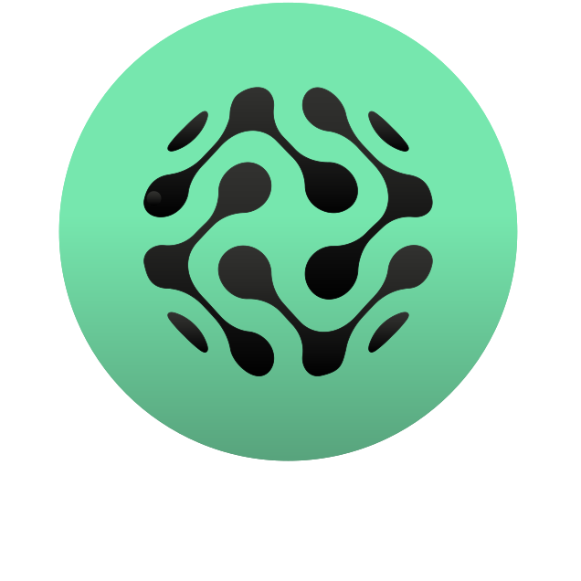

<div id="top"></div>
<!--
*** Thanks for checking out the Best-README-Template. If you have a suggestion
*** that would make this better, please fork the repo and create a pull request
*** or simply open an issue with the tag "enhancement".
*** Don't forget to give the project a star!
*** Thanks again! Now go create something AMAZING! :D
-->

<!-- PROJECT LOGO -->
<br />
<div align="center">
  <a href="https://github.com/elijahhampton/opportunity-client">
    
  </a>
<h3 align="center">Lens Talent</h3>
  <p align="center">
    <br />
    <a href="https://opportunity-website.vercel.app/"><strong>Explore the docs »</strong></a>
    <br />
    <a href="https://opportunity-website.vercel.app/">View Demo</a>
    ·
    <a href="https://github.com/OpportunityProtocol/opportunity-client/issues">Report Bug</a>
    ·
    <a href="https://github.com/OpportunityProtocol/opportunity-client/issues">Request Feature</a>
  </p>
</div>

<!-- PROJECT SHIELDS -->
<!--
*** I'm using markdown "reference style" links for readability.
*** Reference links are enclosed in brackets [ ] instead of parentheses ( ).
*** See the bottom of this document for the declaration of the reference variables
*** for contributors-url, forks-url, etc. This is an optional, concise syntax you may use.
*** https://www.markdownguide.org/basic-syntax/#reference-style-links
-->
<div align="center">
  

[![Contributors][contributors-shield]][contributors-url]
[![Forks][forks-shield]][forks-url]
[![Stargazers][stars-shield]][stars-url]
[![Issues][issues-shield]][issues-url]
[![MIT License][license-shield]][license-url]
  
  </div>


<!-- TABLE OF CONTENTS -->
<details>
  <summary>Table of Contents</summary>
  <ol>
    <li>
      <a href="#about-the-project">About The Project</a>
      <ul>
        <li><a href="#built-with">Built With</a></li>
      </ul>
    </li>
    <li>
      <a href="#getting-started">Getting Started</a>
      <ul>
        <li><a href="#prerequisites">Prerequisites</a></li>
        <li><a href="#installation">Installation</a></li>
      </ul>
    </li>
    <!--<li><a href="#roadmap">Roadmap</a></li>-->
    <li><a href="#contributing">Contributing</a></li>
    <li><a href="#license">License</a></li>
    <li><a href="#contact">Contact</a></li>
  </ol>
</details>


<!-- ABOUT THE PROJECT -->
## About The Project
<div align="left">
      Lens Talent is a decentralized and permission-less freelancing network built with LensProtocol. Lens Talent allows freelancers and employers to find work or create contracts regardless of geographical location. Employers are able to create one time contracts that freelancers may accept, while freelancers are able to create long term services in which employers can invest in in order to bet on their success and quality of work. Through this method freelancers are incentivized to always provide the best quality work as it means a higher chance of passive income. Contracts and services created on Lens Talent have the ability to gain exposure across any networking application that interfaces with LensProtocol. Other important features of Lens Talent include one time identity creation which is persistent along  with self statistics, the ability to leverage your network through content referrals, decentralized dispute services and decentralized payouts. We imagine a world where freelancers can instantly find work at any moment and carry their services across any network based application. Welcome to the cooperation layer of the internet.
  </div>


### Built With

* [Next.js](https://nextjs.org/)
* [React.js](https://reactjs.org/)
* [Redux](https://redux.js.org/)
* [Material-UI](https://mui.com/)
* [The Graph](https://thegraph.com/en/)
* [IPFS](https://ipfs.io/)
* [Pinata](https://www.pinata.cloud/)
* [Waku](https://wakuconnect.dev/)
* [Firebase](https://firebase.google.com/)
* [Solidity](https://docs.soliditylang.org/en/v0.8.14/)
* [EthersJS](https://docs.ethers.io/v5/)

<!-- GETTING STARTED -->
## Getting Started

To get a local copy up and running follow these simple steps.

### Prerequisites

This is an example of how to list things you need to use the software and how to install them.

### Installation

1. You will need an alchemy api key to run the client locally. Get a free Alchemy API Key at ([https://example.com](https://www.alchemy.com/)) You will need to create a .env file and add the variables from the .env_template.
2. Clone the repo
   ```sh
   git clone https://github.com/OpportunityProtocol/opportunity-client.git
   ```
3. Install NPM packages
   ```sh
   yarn install
   ```
4. Run the client locally
   ```sh
   yarn dev
   ```

<!-- ROADMAP -->
<!--
## Roadmap

- [ ] Feature 1
- [ ] Feature 2
- [ ] Feature 3
    - [ ] Nested Feature

See the [open issues](https://github.com/elijahhampton/opportunity-client/issues) for a full list of proposed features (and known issues).
-->


<!-- CONTRIBUTING -->
## Contributing

Contributions are what make the open source community such an amazing place to learn, inspire, and create. Any contributions you make are **greatly appreciated**.

If you have a suggestion that would make this better, please fork the repo and create a pull request. You can also simply open an issue with the tag "enhancement".
Don't forget to give the project a star! Thanks again!

1. Fork the Project
2. Create your Feature Branch (`git checkout -b feature/AmazingFeature`)
3. Commit your Changes (`git commit -m 'Add some AmazingFeature'`)
4. Push to the Branch (`git push origin feature/AmazingFeature`)
5. Open a Pull Request

<!-- LICENSE -->
## License

Distributed under the MIT License. See `LICENSE.txt` for more information.

<!-- CONTACT -->
## Contact

Elijah Hampton - [@elihampton_](https://twitter.com/elihampton_) - hamptonelijahj@gmail.com


Nathan Farley - natefarley@live.com

Project Link: Contact us for a free demo!


<!-- MARKDOWN LINKS & IMAGES -->
<!-- https://www.markdownguide.org/basic-syntax/#reference-style-links -->
[contributors-shield]: https://img.shields.io/github/contributors/elijahhampton/opportunity-client.svg?style=for-the-badge
[contributors-url]: https://github.com/elijahhampton/opportunity-client/graphs/contributors
[forks-shield]: https://img.shields.io/github/forks/elijahhampton/opportunity-client.svg?style=for-the-badge
[forks-url]: https://github.com/elijahhampton/opportunity-client/network/members
[stars-shield]: https://img.shields.io/github/stars/elijahhampton/opportunity-client.svg?style=for-the-badge
[stars-url]: https://github.com/elijahhampton/opportunity-client/stargazers
[issues-shield]: https://img.shields.io/github/issues/elijahhampton/opportunity-client.svg?style=for-the-badge
[issues-url]: https://github.com/elijahhampton/opportunity-client/issues
[license-shield]: https://img.shields.io/github/license/elijahhampton/opportunity-client.svg?style=for-the-badge
[license-url]: https://github.com/elijahhampton/opportunity-client/blob/master/LICENSE.txt
